Traffic Accident Risk Prediction using machine learning
-----------------------------------------------------------------------------------------------------------
The Traffic Accident Risk Prediction project is aimed at developing a system that can predict the likelihood of traffic accidents using Machine Learning algorithms. Traffic accidents are a significant public safety concern, with millions of accidents occurring worldwide each year, resulting in thousands of deaths and injuries. Overall, the Traffic Accident Risk Prediction project highlights the potential of Machine Learning in addressing complex challenges in transportation and public safety, and highlights the importance of using data-driven approaches to develop effective solutions.

__Algorithm / Model Used:__ Random Forest Classifier.
Training Accuracy : 0.99
Test Accuracy: 0.88.

__Kaggle Dataset Link:__
https://www.kaggle.com/datasets/jayaprakashpondy/accident-dataset

__Model Selection:__
We used Random Forest Classifier machine learning algorithm. We got an accuracy of 99.0% on training set so we implemented this algorithm.

__How does the algorithm work?__
It works in four steps:
Select random samples from a given dataset.
Construct a decision tree for each sample and get a prediction result from each decision tree.
Perform a vote for each predicted result.
Select the prediction result with the most votes as the final prediction.

<u>__Instructions to run the application__</u>
-----------------------------------------------------------------------------------------
Python: Ensure Python 3.8 or higher is installed on your system. You can download it from python.org.
pip: Ensure pip (Python package installer) is installed. It usually comes with Python.

Step 1: Download or Clone the Project from GitHub
__URL:__ https://github.com/khatwaniswati/TrafficPredictionSystem.git

Step 2: Navigate to the Project Directory
Once the project is downloaded: Using File Explorer: Open File Explorer and navigate to the folder where the project was downloaded or extracted (e.g., /Volumes/Backup_Storage/Germany/IU/Active/Project-1/Accident_Vehical/ )
Also, to download .pkl file which is too large, use Google drive link and keep the file in Accident_Vehical folder: https://drive.google.com/file/d/1gpvuRJuYJqgYmnElsEiNLpINyn0Z0rhf/view?usp=sharing

Step 3: Open Command Prompt from the Project Directory
To open Command Prompt from the project directory: Using File Explorer: Open the project folder in File Explorer. In the address bar, type cmd and press Enter.

Step 4: Install Project Dependencies
Install the required dependencies:
pip install -r requirements.txt

Step 5: Check Project Directory and Start your application
Ensure you are in the directory that contains the app.py file. If not, navigate to that directory:
cd 'path_to_the_project_folder/Accident_Vehical/app.py'
__To Run Application:__ python app.py

Step 6: Access the Application
Open your Chrome browser and go to: http://localhost:5000
It will open Landing Page(index.html)
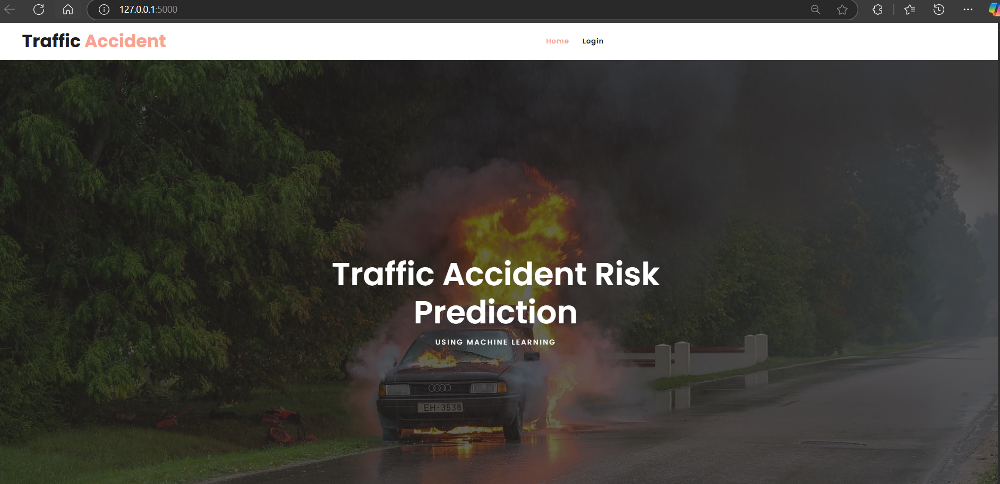

To Login:
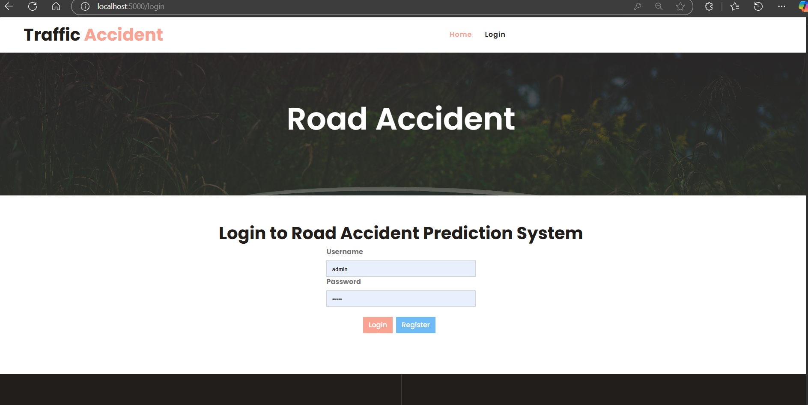
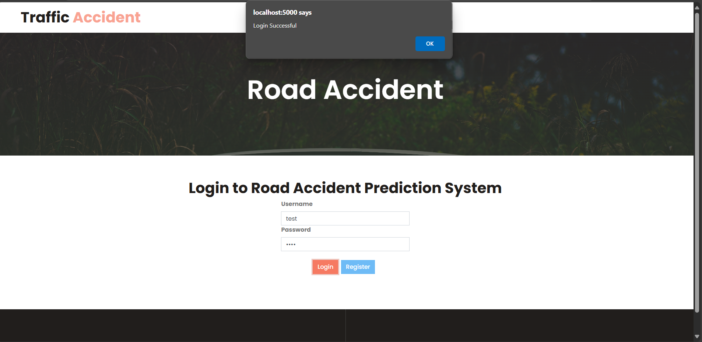

To Register new User:
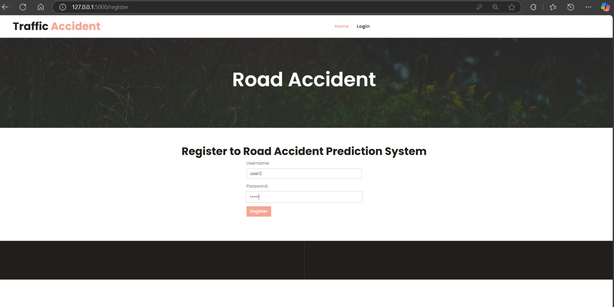

To upload the training data:
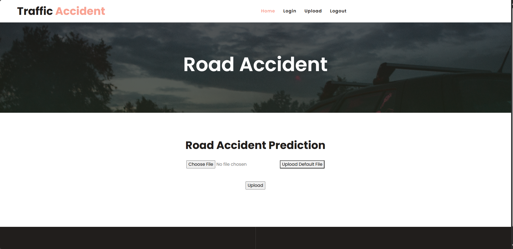
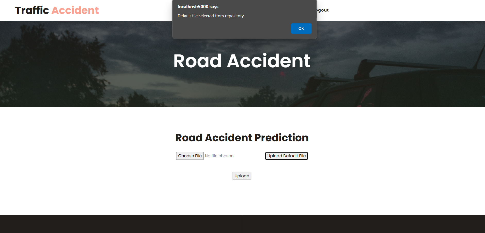

And it will open Preview Page, click Train and test model:
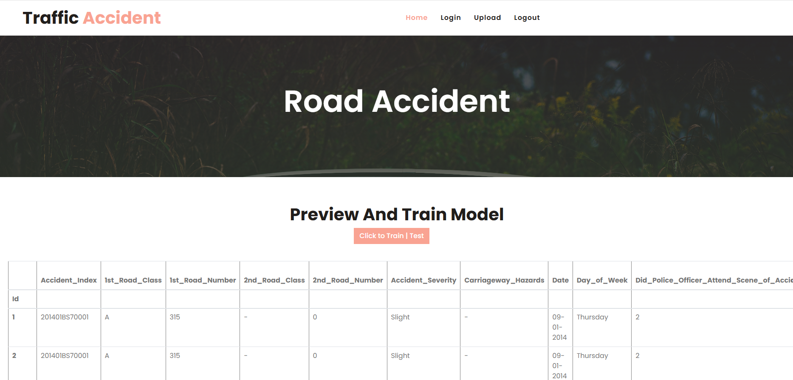
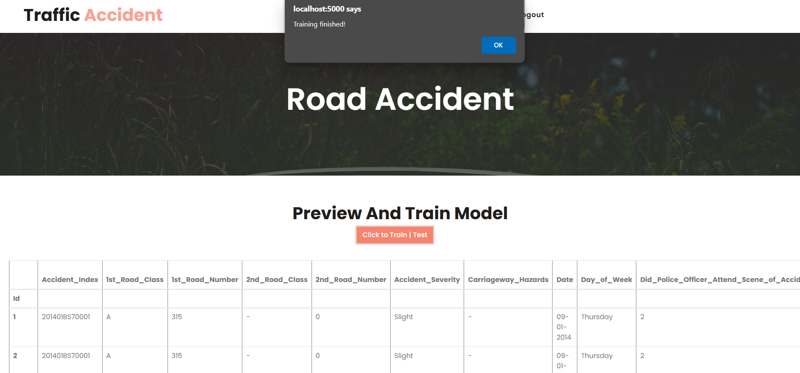

Then the Prediction page will open up, where we can put different input values like lattitude,longitude,etc. to get Prediction Results(i.e. Slight,Severe,Fatal) for Traffic Accidents.
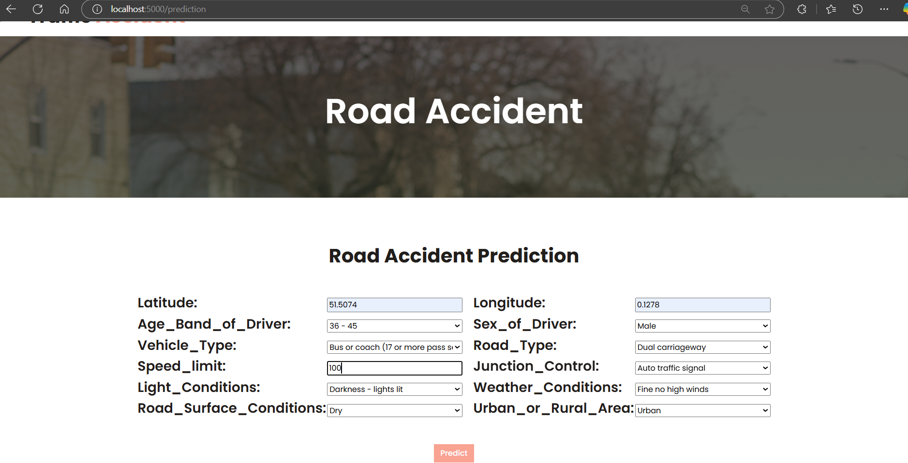
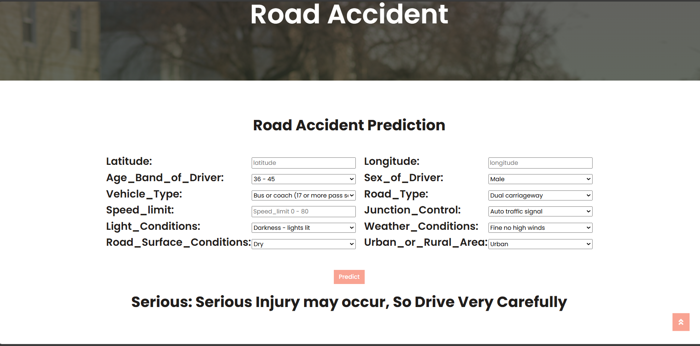

We can view the performance of the system using below page:
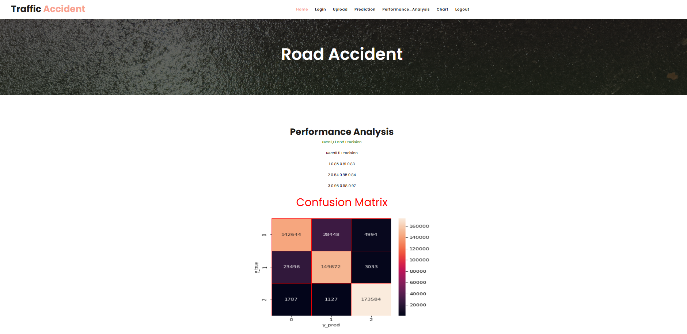
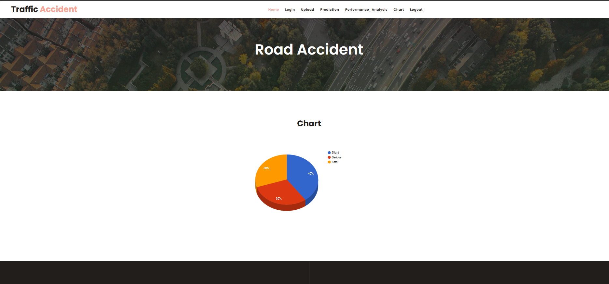

__Accuracy on test set:__
----------------------------------------------------------------------------------------
After training and evaluating the model on the validation set, the accuracy of the model will be assessed on the test set. The accuracy on the test set will be an important metric for evaluating the model's performance. We got an accuracy of 88.0% on test set.

__Saving the Trained Model:__
Once ywe are confident enough to take our trained and tested model into the production-ready environment, the first step is to save it into a .pkl file using a library like pickle.
Make sure you have pickle installed in your environment.